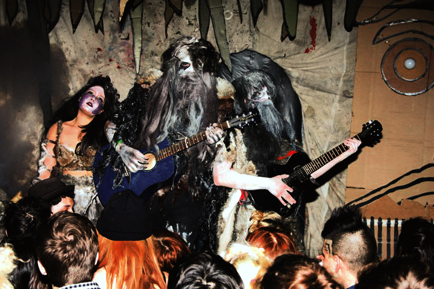
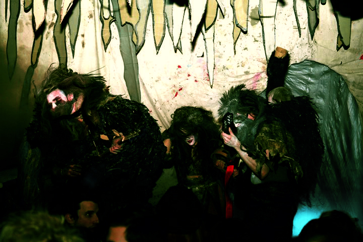
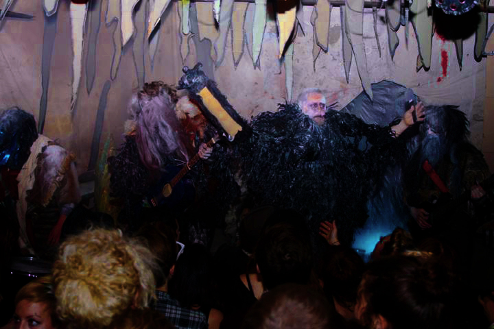

A project I have neglected and hope to focus on in the near future. Death Metal cover band Homeshaven was formed with Barndoor Nemeth, Molly Ryan, Lee Heineman, and Ryan Comisky. Our first and only performance was at The Foundation on New Years Eve – 2012.

